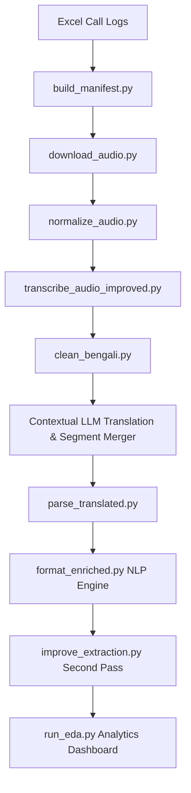

# Rural Healthcare Voice Analytics Pipeline

An end-to-end voice analytics and clinical NLP pipeline designed to process noisy Bengali medical phone call recordings, extract structured clinical data, and automate health outcome reporting for rural clinics. 

> **Project Impact:** Processed **887 call records**, successfully transcribing and structuring critical healthcare metadata (urgency levels, agent compliance, prescribed medications, follow-up status, patient recovery status) to power actionable clinical dashboards.

---

## 📋 Pipeline Architecture & Flow



1. **Audio Ingestion & Normalization**: Builds a processing manifest, handles parallel downloads, and normalizes noisy, multi-format cellular recordings using `ffmpeg`.
2. **Hallucination-Resistant Transcription**: Utilizes `faster-whisper` (large-v3) with customized audio segmenting, repetition penalties, and post-transcription cleaning (`clean_bengali.py`) to handle low-bandwidth audio.
3. **Contextual Translation & Merger**: Combines segments and translates transcripts contextually using a structured LLM pipeline that prevents clinical hallucinations.
4. **Rule-Based Clinical Extraction**: Parses 20+ medical and administrative fields (such as patient compliance, symptoms, drug names, and health severity).
5. **Dashboard Automation**: Generates clean statistics, distribution graphs, and high-priority flags for clinical coordinators.

---

## 🛠️ Tech Stack & Key Libraries

- **Audio Processing**: `faster-whisper` (large-v3, CPU int8/float16), `ffmpeg`
- **NLP & Text Normalization**: `rapidfuzz` (fuzzy matching), `PyYAML`
- **Analytics & Data Processing**: `pandas`, `numpy`, `matplotlib`, `seaborn`
- **Infrastructure**: SQLite (checkpointing & recovery logs), Python 3.10+

---

## 📂 Project Directory Structure

```text
finai-voice-analytics/
├── config/
│   └── extraction_rules.yaml      # Multi-lingual clinical vocabulary and matching rules
├── scripts/
│   ├── eda/
│   │   └── run_eda.py             # Automates plotting and metrics reporting
│   └── improve_extraction.py      # Refines parsed data fields for clinical accuracy
├── src/
│   ├── nlp/
│   │   ├── clean_bengali.py       # Whisper repetitiveness and noise filters
│   │   ├── format_enriched.py     # Schema validator and rule-based extraction engine
│   │   └── translate_english.py   # Codebase reference for English translations
│   ├── pipeline/
│   │   ├── build_manifest.py      # Ingests spreadsheet logs to build system manifest
│   │   ├── download_audio.py      # Multi-threaded file downloader
│   │   ├── normalize_audio.py     # Codec and loudness normalizer
│   │   ├── transcribe_audio.py    # Baseline transcriber
│   │   └── transcribe_audio_improved.py # Whisper wrapper with quality scorers
│   └── utils/
│       ├── sqlite_checkpoint.py   # State management to prevent progress loss
│       └── transcript_quality.py  # Evaluates transcription density and noise ratio
├── parse_translated.py            # Extracts LLM-translated payloads back into JSONL
└── README.md                      # Quickstart guide
```

---

## 🚀 Step-by-Step Execution Guide

### 1. Ingestion & Preprocessing
Prepare your excel call sheets and generate the download manifests:
```bash
# Build the call manifest
python src/pipeline/build_manifest.py

# Download target audio files
python src/pipeline/download_audio.py

# Standardize sample rates and audio loudness
python src/pipeline/normalize_audio.py
```

### 2. High-Fidelity Transcription
Execute the speech-to-text pipeline featuring custom Bengali post-processing and text-density calculations to isolate call quality:
```bash
python src/pipeline/transcribe_audio_improved.py
```

### 3. Translation & Segment Consolidation
For optimal contextual preservation, segments are consolidated and translated using an LLM prompt that prevents hallucinations:
1. Paste the generated JSONL segments from step 2 into Gemini.
2. Prompt:
   > *"Can you join the segments and translate to English? Do not hallucinate, keep the translations in context, and do not add information that is not directly mentioned."*
3. Save the translated text file to `translated.txt`.
4. Parse the file back into structured JSONL records:
   ```bash
   python parse_translated.py
   ```

### 4. Structured Clinical NLP Extraction
Run the two-pass rule engine to extract structured medical metadata (symptoms, drugs, compliance flags, recovery rate):
```bash
python -m src.nlp.format_enriched --export-csv
```

### 5. Automated Analytics & EDA
Generate production-ready Matplotlib/Seaborn graphics showing clinical insights:
```bash
# Clean old reports and rebuild dashboards
python scripts/eda/run_eda.py
```

*Note: You can run steps 3 through 5 in one combined command:*
```bash
python parse_translated.py && python -m src.nlp.format_enriched --export-csv && python scripts/eda/run_eda.py
```

---

## 🛡️ Key Features & Engineering Enhancements

- **Whisper Repetition Guard**: Uses dynamic character repetition scoring in `clean_bengali.py` to strip out infinite-loop hallucinations triggered by Whisper on noisy, silent, or static portions of phone call audio.
- **Robust Error Recovery**: Utilizes a persistent SQLite system via `sqlite_checkpoint.py` to record progress. Any interrupted run resumes from the last successfully processed recording without reprocessing audio.
- **Fuzzy Clinical Matching**: Matches raw patient pronunciations of critical medications and clinical conditions to official terminology structures using custom configurations in `extraction_rules.yaml` powered by `rapidfuzz`.
